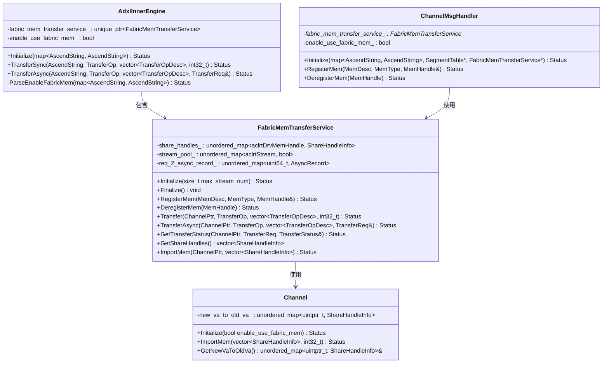
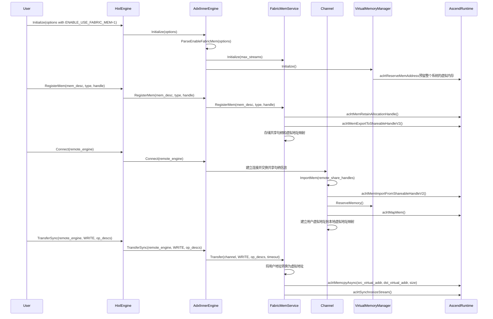

#### Fabric Mem传输模式需求
##### 介绍
**需求的背景**：
1. 随着大语言模型(LLM)推理规模的扩大，KV Cache的规模越来越大，业界形成了多级缓存的解决方案，其中以Mooncake为代表，其中的Mooncake store组件可以用来构建一个分布式DRAM缓存池，对于npu从HBM传输到DRAM(D2RH)的传输性能提出更高的要求。
2. A3服务器提供了Fabric Memory技术，支持超节点内DRAM内存统一编址，能够利用HCCS链路进行D2RH/RH2D的传输，其实测传输带宽分别达到64GB/s和103GB/s，相比之下，roce传输带宽仅为20GB/s。 
3. 其他模式的限制与劣势： 
   * 底层调用HCCL接口的HCCS传输模式不支持D2RH传输。
   * 中转模式在A3上的性能受没有PCIE的限制，与模型抢占HBM带宽，对模型推理影响较大。

##### 输入&输出
**使用时的输入介绍**：
1. **配置选项**：通过`OPTION_ENABLE_USE_FABRIC_MEM`选项启用Fabric Mem模式，值为"1"表示启用
2. **内存描述**：注册内存，使用`MemDesc`结构体，包含内存地址和长度
3. **传输操作**：传输时使用`TransferOp`枚举(READ/WRITE)描述方向，使用`TransferOpDesc`描述传输地址

**使用example**：
```cpp
// 初始化HIXL引擎，启用Fabric Mem模式
Hixl engine1;
std::map<AscendString, AscendString> options1;
options1[OPTION_ENABLE_USE_FABRIC_MEM] = "1";
engine1.Initialize("127.0.0.1", options1);

// 注册内存
std::vector<uint8_t> buffer(size, 0xAA);
hixl::MemDesc mem_desc{};
mem_desc.addr = reinterpret_cast<uintptr_t>(buffer.data());
mem_desc.len = size;
MemHandle handle = nullptr;
engine1.RegisterMem(mem_desc, MEM_HOST, handle);

// 建立连接
engine1.Connect("127.0.0.1:26001");

// 执行传输
TransferOpDesc desc{src_addr, dst_addr, size};
engine1.TransferSync("127.0.0.1:26001", WRITE, {desc});
```

**使用时传出的输出介绍**：
1. **内存句柄**：注册内存时，返回`MemHandle`类型，用于标识已注册的内存区域
2. **传输请求**：异步传输时，返回`TransferReq`类型，用于异步传输的状态查询
3. **传输状态**：查询异步任务状态，返回`TransferStatus`枚举，表示异步传输的完成状态

##### 处理


**类图**：


**时序图**（Fabric Mem模式下的数据传输）：


**整个特性的处理过程介绍**：
1. **初始化阶段**：
   - 用户通过`OPTION_ENABLE_USE_FABRIC_MEM`选项启用Fabric Mem模式
   - `AdxlInnerEngine`解析选项，创建`FabricMemTransferService`实例
   - 服务初始化时获取设备ID并设置最大流数量

2. **内存注册阶段**：
   - 用户调用`RegisterMem`注册内存
   - `FabricMemTransferService`通过`aclrtMemRetainAllocationHandle`获取物理内存句柄
   - 使用`aclrtMemExportToShareableHandleV2`导出为Fabric可共享句柄
   - 将共享句柄信息存储在`share_handles_`映射中

   **H2H传输模式的特殊性**：
   - 对于HOST内存，Fabric Mem传输需要额外的转换处理
   - HOST内存需要先通过`aclrtMemRetainAllocationHandle`获取物理内存句柄
   - 然后使用`aclrtMemExportToShareableHandleV2`导出为共享句柄
   - 然后进行VMM映射，将物理内存映射到虚拟地址空间

3. **连接建立阶段**：
   - 建立连接时，双方交换内存注册信息：主要是`share_handles_`信息
   - 对端通过`ImportMem`导入远程内存的共享句柄
   - 使用`aclrtMemImportFromShareableHandleV2`导入共享句柄，映射到虚拟地址空间
   - 建立本地虚拟地址到远程虚拟地址的映射关系

4. **数据传输阶段**：
   - 先进行用户虚拟地址和映射后的虚拟地址转换
   - 从stream pool获取一次任务需要的流资源，目前默认一次任务默认4条流，后续可配置
   - 使用`aclrtMemcpyAsync`执行设备间的内存拷贝操作
   - 同步则阻塞等待，异步在一条额外的流上下发EventRecord, 使用`aclrtStreamWaitEvent`建立拷贝任务流和额外的EventRecord流的关系，查询任务状态则以调用`aclrtQueryEventStatus`查询拷贝任务状态

5. **资源清理阶段**：
   - 用户调用`DeregisterMem`注销内存
   - 释放物理内存句柄和共享句柄
   - 清理所有资源，包括流、异步资源和导入的内存映射

##### 端到端使用流程

1. **内存申请**：
   ```cpp
   // 使用aclrtReserveMemAddress预留虚拟地址空间
   aclrtReserveMemAddress(&va, mem_size, 0, nullptr, 1);

   // 配置物理内存属性：设备内存、大页模式
   aclrtPhysicalMemProp prop{};
   prop.handleType = ACL_MEM_HANDLE_TYPE_NONE;
   prop.allocationType = ACL_MEM_ALLOCATION_TYPE_PINNED;
   prop.memAttr = ACL_HBM_MEM_HUGE;
   prop.location.type = ACL_MEM_LOCATION_TYPE_DEVICE;
   prop.location.id = device_id;

   // 分配物理内存并映射到虚拟地址空间
   aclrtMallocPhysical(&pa_handle, mem_size, &prop, 0);
   aclrtMapMem(va, mem_size, 0, pa_handle, 0);

   // 初始化内存数据：从主机拷贝到设备
   aclrtMallocHost(&host_data, mem_size);
   memset_s(host_data, mem_size, device_id, mem_size);
   aclrtMemcpy(va, kMemSize, host_data, mem_size, ACL_MEMCPY_HOST_TO_DEVICE);
   ```
   - 与传统内存申请不同，Fabric Mem需要使用物理内存句柄
   - 需要显式映射物理内存到虚拟地址
   - 使用大页模式（ACL_HBM_MEM_HUGE）提升性能

2. **引擎初始化和内存注册**：
   - 启用Fabric Mem模式：`options[OPTION_ENABLE_USE_FABRIC_MEM] = "1"`
   - 初始化Hixl
   - 注册特殊申请的内存：`engine.RegisterMem(desc, MEM_DEVICE, handle)`

3. **连接建立和数据交换**：
   - 调用Connect方法建立连接

4. **数据传输和验证**：
   - 执行D2D传输：`engine.TransferSync(remote_engine, WRITE, {desc})`
   - 验证传输结果：读取远程写入的数据并验证

**端到端流程的关键特点**：
- 内存申请需要使用特殊的物理内存API，而非传统的`aclrtMalloc`
- 需要显式管理虚拟地址到物理内存的映射关系
- 传输完成后需要通过验证确保数据正确性


##### 关键检查点
**检查点列表**：
1. **配置冲突检查**：Fabric Mem模式与Buffer Pool模式不能同时启用，在`ParseBufferPoolParams`中检查
2. **内存类型检查**：在Fabric Mem模式下，设备内存注册需要特殊处理
4. **传输参数检查**：验证传输描述中的地址范围是否在已注册的内存范围内
5. **流资源管理检查**：确保流池中的流资源正确分配和释放，避免资源泄漏
6. **异步请求状态检查**：异步传输时正确跟踪请求状态，确保状态查询的准确性
7. **内存映射清理检查**：连接断开时正确清理导入的内存映射关系
8. **并发安全检查**：多线程环境下对共享数据结构的访问安全
9. **对端异常下线**：对端异常下线时，需要清理相关资源，避免资源泄漏

**性能关键点**：
1. **流池管理**：预创建和管理设备流，避免频繁创建销毁的开销
2. **多流并发**：支持一次使用多条流并发处理
3. **异步操作**：支持异步传输，允许重叠计算和通信

**兼容性考虑**：
1. **向后兼容**：默认不启用Fabric Mem模式，保持与传统模式的兼容性