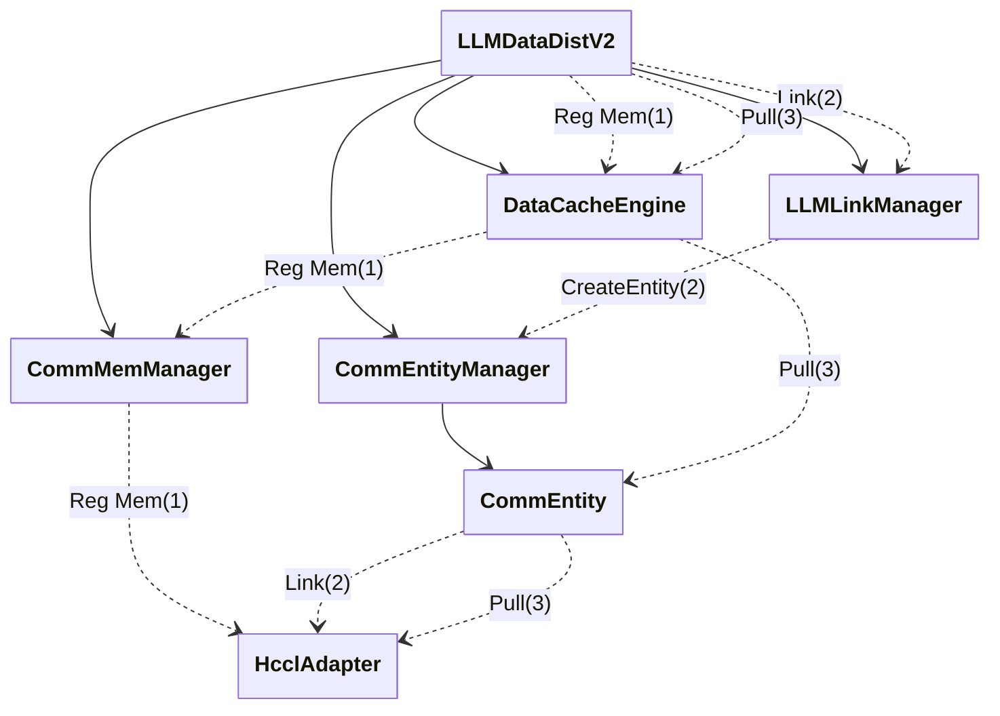
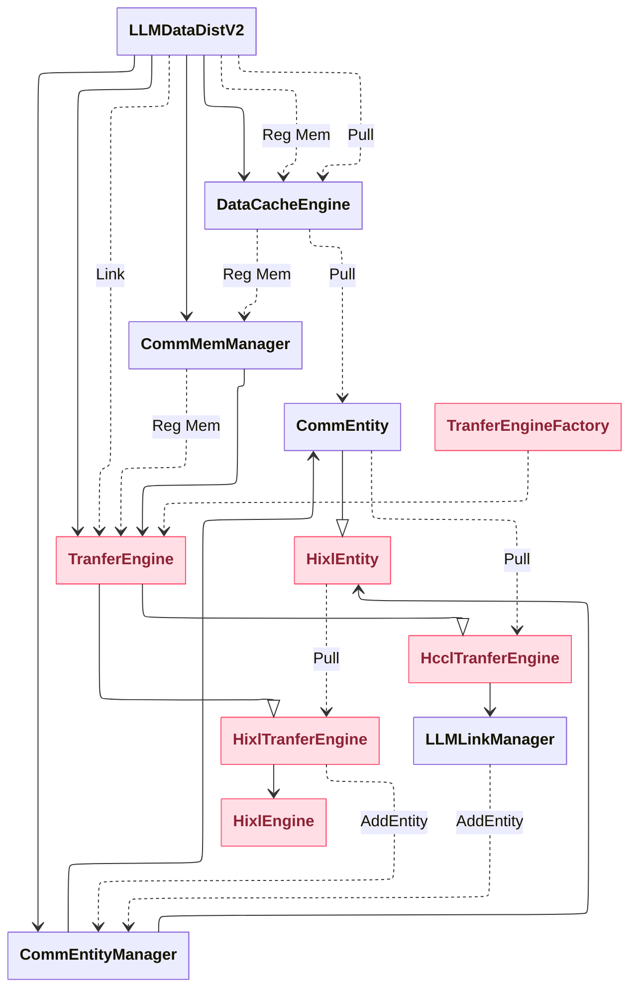
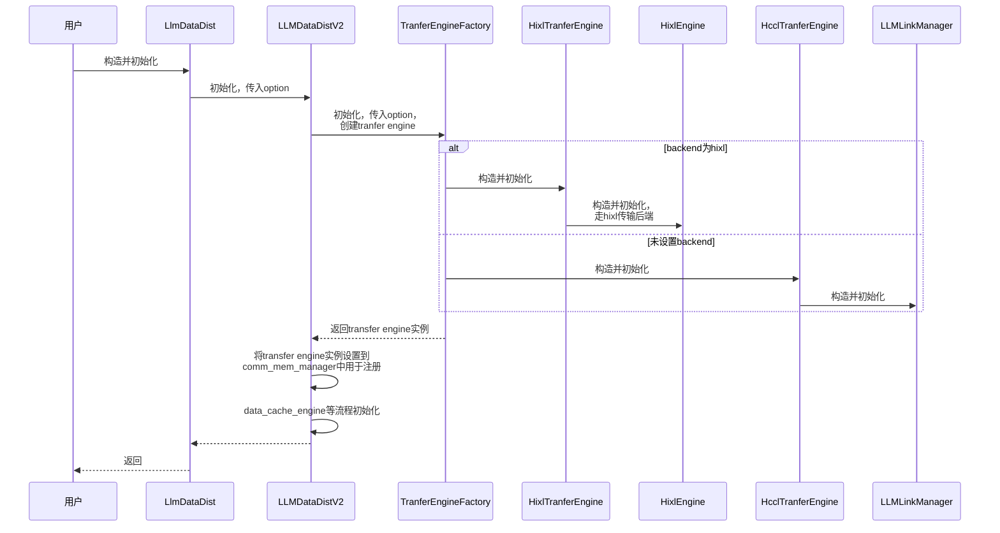
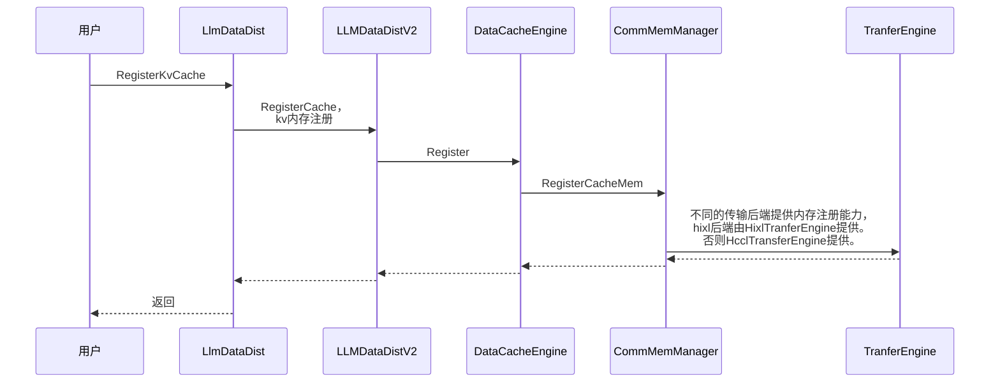
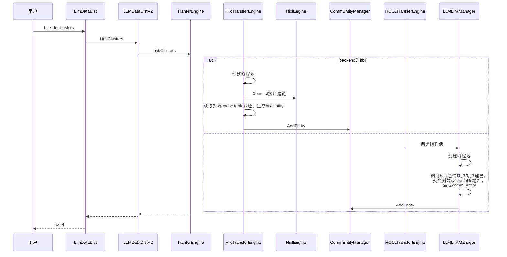
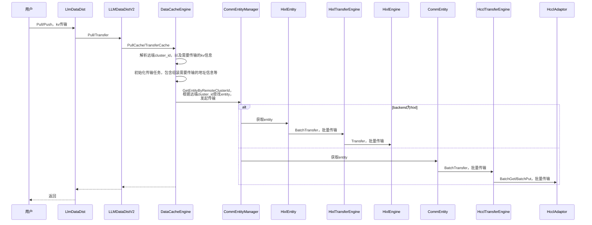

# LLM-DataDist支持HIXL传输后端

## 需求描述

- 背景介绍
HCCL提供单边通信库，与集合通信库并列，共同作为通信库对外提供的基础能力。LLM-DataDist需进行对接，以支持更多芯片类型和更多的通信能力。
- 需要做什么
LLM-DataDist V2的单向建链流程对接HCCL单边通信库，支持当前接口已有能力。

## 功能要点
- [ ] LLM-DataDist提供对接HCCL单边通信API能力。
```
支持解析本地通信资源option，通过Hixl提供链路管理与传输能力，并兼容原生能力。
需要对建链、断链、内存注册、注销以及数据传输流程进行抽象，同时支持基于Hixl和Hccl通信域实现相关能力。
```

## 技术方案

**新增API和option**：
```
# 已有option key如下，用于描述本地可以使用的通信资源信息，需要支持1.3版本格式
constexpr const char OPTION_LOCAL_COMM_RES[] = "llm.LocalCommRes";
# option value为json格式字符串，支持1.3版本格式如下：
std::string local_comm_res = R"(
{
  "version": "1.3",
  "net_instance_id": "superpod1_1",
  "endpoint_list": [
    {
      "protocol": "ub_ctp",
      "comm_id": "eid0-0",
      "placement": "host",
      "plane": "plane-a",
    },
    {
      "protocol": "ub_ctp",
      "comm_id": "eid0-1",
      "placement": "device",
      "dst_eid": "eid1-1",
    },
    {
      "protocol": "ub_ctp",
      "comm_id": "eid0-2",
      "placement": "device",
      "dst_eid": "eid1-2",
    },
    {
      "protocol": "ub_tp",
      "comm_id": "eid0-3",
      "placement": "device",
      "plane": "plane-a",
    },
    {
      "protocol": "roce",
      "comm_id": "ipv4/ipv6地址",
      "placement": "host" 
    }
  ]
}
)";

新增option:tranfer_backend，用于支持设置使用的传输后端，由于hixl engine需要支持对接hixl cs的接口能力，llm-datadist可以复用hixl能力，因此对llm-datadist传输层抽象为传输后端，支持使用hixl作为llm-datadist传输后端，以复用hixl的基础能力。
配置方式如下：
config.tranfer_backend = "hixl"
```

# 通信设备配置字段说明
| 字段名 | 数据类型 | 必选/可选 | 说明 | 支持值/填写规则 |
| ---- | ---- | ---- | ---- | ---- |
| version | 字符串 | 必选 | 版本号 | "1.3" |
| net_instance_id | 字符串 | 必选 | 当前超节点的唯一标识 | 每个超节点唯一即可 |
| endpoint_list | 数组 | 必选 | 可以使用的通信设备列表 | - |
| endpoint_list[].protocol | 字符串 | 必选 | 通信协议 | "roce"/"ub_ctp"/"ub_tp" |
| endpoint_list[].comm_id | 字符串 | 必选 | 通信标识 | protocol为ub_ctp/ub_tp时填${eid}；protocol为roce时填ipv4/ipv6网卡地址 |
| endpoint_list[].placement | 字符串 | 必选 | 通信设备位置 | "host"/"device" |
| endpoint_list[].plane | 字符串 | 可选 | 通信设备平面 | protocol为ub_ctp/ub_tp时，设备区分平面则填写，每个平面唯一（如"plane-a"/"plan-b"） |
| endpoint_list[].dst_eid | 字符串 | 可选 | 与当前通信设备连接的对端通信设备的${eid} | protocol为ub_ctp时，存在full-mesh直连对端则填写对端${eid} |


**C++调用伪码**:
```
LlmDataDist llm_datadist_p(1U, LlmRole::kPrompt);
std::map<AscendString, AscendString> options_p;
options_p[llm_datadist::OPTION_LISTEN_IP_INFO] = "127.0.0.1:26000";
options_p[llm_datadist::OPTION_DEVICE_ID] = "0";
options_p[llm_datadist::OPTION_TRANSFER_BACKEND] = "hixl";
options_p[llm_datadist::OPTION_LOCAL_COMM_RES] = R"(
{
   "net_instance_id": "superpod1_1",
   "endpoint_list": [
       {
           "protocol": "roce",
           "comm_id": "1.0.0.1",
           "placement": "host"
       }
   ],
   "version": "1.3"
}
)";


llm_datadist_p.Initialize(options_p);

LlmDataDist llm_datadist_d(2U, LlmRole::kDecoder);
std::map<AscendString, AscendString> options_d;
options_d[llm_datadist::OPTION_LISTEN_IP_INFO] = "127.0.0.1:26001";
options_d[llm_datadist::OPTION_DEVICE_ID] = "1";
options_d[llm_datadist::OPTION_TRANSFER_BACKEND] = "hixl";
options_d[llm_datadist::OPTION_LOCAL_COMM_RES] = R"(
{
   "net_instance_id": "superpod2_1",
   "endpoint_list": [
       {
           "protocol": "roce",
           "comm_id": "1.0.0.2",
           "placement": "host"
       }
   ],
   "version": "1.3"
}
)";

llm_datadist_d.Initialize(options_d);

// 内存注册
llm_datadist_p.RegisterKvCache(cache_desc1, tensor_addrs1, {}, cache_id1);
llm_datadist_d.RegisterKvCache(cache_desc2, tensor_addrs2, {}, cache_id2);


llm_datadist_d.LinkLlmClusters(clusters1, rets);
```

**当前LLM-DataDist类图主体关系**：


- LLMDataDistV2为主体入口，对外提供建链断链，内存注册注销，以及数据传输能力
- DataCacheEngine提供内存注册、注销以及传输能力
- LLMLinkManager提供建链、断链能力
- CommMemManager提供内存注册、注销能力
- CommEntityManager提供链路管理能力，每个CommEntity代表一条点对点传输链路
- HcclAdapter提供底层建链断链、内存注册注销和数据传输


**LLM-DataDist对接HCCL单边通信库类图主体关系**：


- 对链路的建链、断链相关流程和内存注册、注销、传输相关流程进行抽象为TranferEngine，提供工厂类支持根据传入的OPTION_TRANSFER_BACKEND不同，创建不同的实例，如果指定的格式version为1.3则创建Hixl相关实例；否则生成原来版本的实例，兼容之前的逻辑
- HixlTranferEngine提供hixl engine的建链、断链、注册注销和传输能力。
- HcclTranferEngine兼容原生逻辑，使用hccl相关的接口提供建链、断链、注册注销和传输能力。

**初始化流程时序图**：

- 通过传输后端option值是否为hixl确定是否走新流程，否则兼容老版本逻辑
- 新流程中通过HixlTranferEngine保存的hixl engine进行内存注册注销，建链以及传输，初始化需要listen ip info信息
- 兼容流程通过HcclTranferEngine提供能力，与原初始化流程基本相同，不再赘述

**内存注册、注销流程时序图**：

- 注销与注册流程基本相同，不再赘述

**建链流程时序图**：

- HixlTransferEngine通过HixlEngine的Connect接口完成建链，需创建socket获取对端cache table地址，用于后续数据面通信
- 不支持非远端cache索引模式，即access_remote_cache为false场景
- 不支持双向建链，调用Link相关接口报错，返回不支持
- 强制建链（client退出后，重新发起建链可以建链成功，该能力HCCL开源开放单边通信支持）
- SetRole能力，在hixl后端场景，需要两侧均制定ip port，均作为server并可以与对端发起建链并完成数据面通信，因此与角色无关，直接返回成功。

**传输流程时序图**：

- 建链一条链路，双侧均可进行数据收发不支持。
- 只能由client侧（即调用LinkClusters侧）发起数据读写。如需双侧相互访问，需要由server侧向client侧也发起LinkClusters进行建链

## 端到端使用指导

python使用参考
```
examples/python/hixl_tranfer_backend_sample.py
```

## 备注
1. 初始化需指定传输后端option为hixl
2. 初始化需指定本地监听的ip和端口
3. 与对端发起传输前需要提前建链